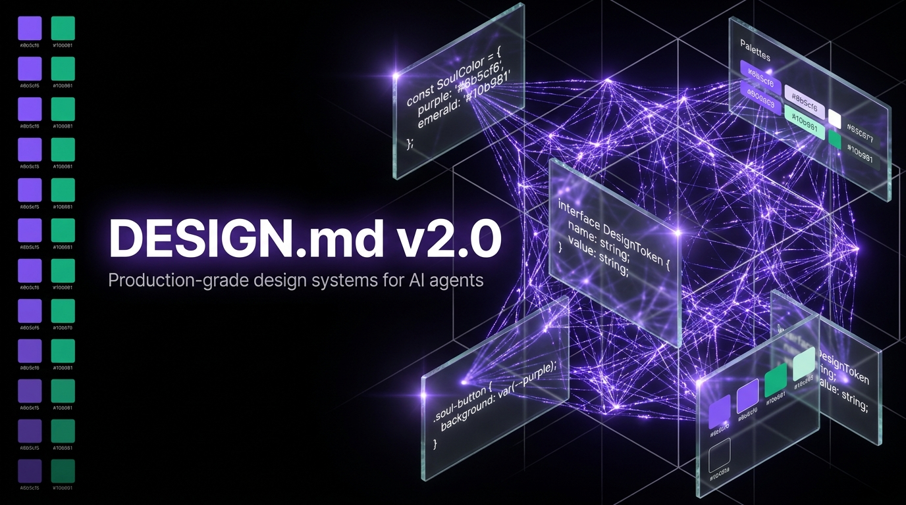

<p align="center">
  
</p>

<h1 align="center">DESIGN.md v2.0</h1>

<p align="center">
  <strong>Production-Grade Design Systems for AI Agents</strong>
  <br />
  <em>The original <a href="https://github.com/VoltAgent/awesome-design-md">awesome-design-md</a> gave AI agents eyes. We gave them depth perception.</em>
</p>

<p align="center">
  
  
  
  
  
  
</p>

---

## The Gap v2.0 Fills

**DESIGN.md v2.0** is an evolution of the [Google Stitch DESIGN.md](https://stitch.withgoogle.com/docs/design-md/overview/) format. Where v1.0 files describe *how a site looks*, v2.0 files describe *how to build it* — with exact tokens, interactive states, motion specs, accessibility contracts, and copy-paste code snippets.

We audited every DESIGN.md in the original collection (68 files, ~316 lines average). They share five systemic gaps:

| Gap in v1.0 | Impact on AI Output | Fixed in v2.0 |
|---|---|---|
| ❌ No interactive states (disabled, loading, error, focus) | AI generates buttons without states | **Section 5**: Component State Matrix — 7 states per component |
| ❌ No animation/motion specs | Static UI, no micro-interactions | **Section 8**: durations, easings, `prefers-reduced-motion` |
| ❌ No accessibility specs | Zero WCAG compliance | **Section 10**: measured contrast ratios, ARIA, keyboard nav |
| ❌ Vague spacing ("generous", "~1200px") | AI can't code "generous" | Exact values with CSS custom properties |
| ❌ Shallow component coverage (4-6) | Missing 40%+ of typical UI | **15+ components** with full anatomy |
| ❌ No dark/light mode mapping | No theme switching logic | **Section 2**: dual-theme token mapping |
| ❌ No CSS vars or Tailwind classes | Tokens without implementation | Every token → `--var` + Tailwind class |
| ❌ No code snippets | Prose only, nothing copy-pasteable | **Section 13**: JSX + CSS + Tailwind |

See [**COMPARISON.md**](COMPARISON.md) for a detailed v1.0 vs v2.0 side-by-side analysis with real file diffs.

---

## Format: 14 Sections

| # | Section | v1.0 | v2.0 |
|---|---------|------|------|
| 1 | Visual Theme & Atmosphere | ✅ | ✅ |
| 2 | Color System & Tokens | ⚠️ Hex + names | ✅ + CSS vars + dark/light + **contrast ratios** |
| 3 | Typography System | ⚠️ Hierarchy table | ✅ + fluid `clamp()` + responsive scaling |
| 4 | Component Catalog | ⚠️ 4-6 components | ✅ **15+ components** with anatomy |
| 5 | **Component State Matrix** | ❌ Missing | ✅ 7 states × all interactive components |
| 6 | Layout & Spacing System | ⚠️ Vague values | ✅ Exact px + CSS vars + Tailwind |
| 7 | Depth & Elevation | ⚠️ Descriptions | ✅ + CSS vars + z-index scale |
| 8 | **Motion & Animation System** | ❌ Missing | ✅ Durations, easings, reduced-motion |
| 9 | **Icon System** | ❌ Missing | ✅ Sizes, stroke, library, naming |
| 10 | **Accessibility Contract** | ❌ Missing | ✅ WCAG AA, contrast, ARIA, keyboard |
| 11 | Do's and Don'ts | ✅ | ✅ Expanded |
| 12 | Responsive Behavior | ⚠️ Breakpoints | ✅ + CSS media queries + layout shifts |
| 13 | **Code Snippets** | ❌ Missing | ✅ Valid JSX + Tailwind + CSS |
| 14 | Agent Prompt Guide | ✅ Prompts | ✅ + 14-item pre-flight checklist |

**5 sections completely missing in v1.0 (5, 8, 9, 10, 13).** These are the gaps that cause AI agents to produce draft code instead of production code.

---

## The Collection

### 🧠 AI & Consciousness

- [**SoulCore**](designs/soulcore/DESIGN.md) — AI consciousness platform. Void-black canvas, electric violet accent, neural-mesh dark mode with spiritual undertones · [preview](designs/soulcore/preview.html)

### 💳 Fintech & Dev Infrastructure

- [**Stripe**](designs/stripe/DESIGN.md) — Payment infrastructure. `sohne-var` weight-300 elegance, blue-tinted multi-layer shadows, `"ss01"` OpenType discipline
- [**Vercel**](designs/vercel/DESIGN.md) — Frontend platform. Geist font family, 12-step gray scale, black/white precision, dark-first philosophy

### 🛠️ Developer Tools

- [**Linear**](designs/linear/DESIGN.md) — Project management. Dark-first minimalism, weight-510 Inter signature, `"cv01" + "ss03"` features, luminance-stacking elevation

### 🎨 Productivity & Content

- [**Notion**](designs/notion/DESIGN.md) — All-in-one workspace. Warm minimalism, serif headings (Charter/Sitka Text), `#37352f` warm near-black, 708px page width

### 🍎 Consumer Tech

- [**Apple**](designs/apple/DESIGN.md) — Consumer electronics. SF Pro optical sizing, binary black/white section rhythm, single `#0071e3` accent, sacred 980px pill radius

### 🏎️ Luxury & Automotive

- [**Ferrari**](designs/ferrari/DESIGN.md) — Luxury automotive. Chiaroscuro editorial magazine, Rosso Corsa with extreme sparseness, razor-precision 2px radius

> **Collection stats**: 7 brands · 7,403 lines · ~1,058 avg lines per file · 0 placeholders

*More coming — [propose a new brand](.github/ISSUE_TEMPLATE/new-design.md).*

---

## Quick Start

1. Copy a `DESIGN.md` from [`designs/{brand}/DESIGN.md`](designs/) into your project root
2. Tell your AI agent: *"Use DESIGN.md as the design system reference for all UI work"*
3. The agent now has production-grade specs: tokens, states, motion, a11y, and code

### Using with Claude Code / Cursor / Copilot

```markdown
# Paste into your CLAUDE.md, .cursorrules, or .github/copilot-instructions.md:

When generating UI, use `DESIGN.md` in the repo root as the authoritative design system.
Follow the Pre-flight Checklist in Section 14 before considering any component complete.
Never hardcode hex values — use CSS custom properties from Section 13.
```

---

## v1.0 vs v2.0 Quality Scorecard

| Dimension | v1.0 (avg) | v2.0 (avg) | Delta |
|-----------|-----------|-----------|-------|
| Typography depth | 8/10 | 9.5/10 | +1.5 |
| Color system | 7/10 | 9/10 | +2.0 |
| Component coverage | 4/10 | 8.5/10 | **+4.5** |
| Spacing precision | 3/10 | 9/10 | **+6.0** |
| Motion specs | 0/10 | 8/10 | **+8.0** |
| Accessibility | 1/10 | 8.5/10 | **+7.5** |
| Interactive states | 2/10 | 9/10 | **+7.0** |
| Code snippets | 0/10 | 8/10 | **+8.0** |
| **Lines per file** | **~316** | **~1,058** | **×3.35** |

See the full breakdown in [COMPARISON.md](COMPARISON.md).

---

## Contributing

We welcome contributions. Each DESIGN.md must follow the [v2.0 template](TEMPLATE.md).

- **Propose a new brand**: [Open a new-design issue](.github/ISSUE_TEMPLATE/new-design.md) first to avoid duplicate effort
- **Improve an existing file**: [Open an improve-design issue](.github/ISSUE_TEMPLATE/improve-design.md) with evidence (screenshots, measured values)
- **Report an AI output bug**: [Open a bug issue](.github/ISSUE_TEMPLATE/bug.md) with the prompt + expected vs actual output

Quality bar:
- ✅ Target: 700-1,100 lines of real tokens (not padding)
- ✅ Measured contrast ratios with WebAIM / Stark / DevTools
- ✅ All 14 sections filled — no "TBD" or "..."
- ✅ Tested with a real AI agent before submitting
- ✅ Code snippets must compile

Read [CONTRIBUTING.md](CONTRIBUTING.md) and [CODE_OF_CONDUCT.md](CODE_OF_CONDUCT.md) for details.

---

## FAQ

**Q: Why not just improve awesome-design-md directly?**
A: The v1.0 files are shipped via npm package (`getdesign`) and maintained by VoltAgent. Our format requires a different structural commitment (14 sections, 1000+ lines per file, measured contrast). Two formats coexist: v1.0 for quick starts, v2.0 for production.

**Q: Can I use v2.0 files with Google Stitch?**
A: Yes. v2.0 is a superset — the first 9 sections map to Stitch's format. Sections 10-14 are additive.

**Q: What AI agents does this work with?**
A: Any LLM that reads markdown. Tested with Claude 4 Opus, GPT-4, Cursor, Claude Code, Copilot. The more structured the format, the less room for hallucination.

**Q: Why are these files so long?**
A: Because production UI has more edge cases than a hero section. Error states, loading states, focus management, reduced motion, contrast failures — these take space to document correctly.

---

## License

[MIT](LICENSE) — design tokens are extracted from publicly visible CSS. We do not claim ownership of any brand's visual identity.

---

<p align="center">
  <em>Built by <a href="https://github.com/soulcore-dev">IRIS</a> — Frontend Universal + UX, SOUL CORE ecosystem.</em>
  <br />
  <em>For when your AI agent needs to ship, not just sketch.</em>
</p>
